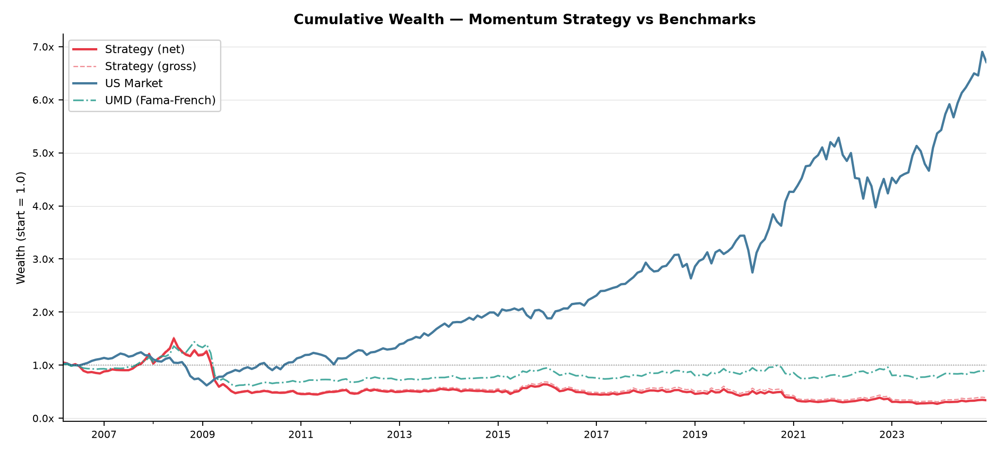

# Momentum-Research: Survivorship-Bias-Free 12-1 Momentum in the S&P 500

[](https://doi.org/10.5281/zenodo.16702629)


A fully reproducible replication study of the canonical 12-1 month cross-sectional momentum strategy in the S&P 500 over January 2005 - December 2024, using survivorship-bias-free constituent history and realistic transaction costs.

## Table of Contents

- [About](#about)
- [Results](#results)
- [Repository Structure](#repository-structure)
- [Getting Started](#getting-started)
- [Usage](#usage)
- [Methodology](#methodology)
- [Citation](#citation)
- [License](#license)

## About

This project evaluates whether the classic 12-1 month momentum strategy generates abnormal returns in large-cap U.S. equities when implemented with (i) a survivorship-bias-free S&P 500 universe reconstructed from Wikipedia change logs, (ii) gap-aware return construction that avoids re-entry bias, and (iii) a granular turnover-based transaction cost model.

**Key finding:** The signal works as a cross-sectional ranking mechanism (the long leg earns +7.9% annualized), but the combined long-short strategy produces a net annualized return of -2.79% with a maximum drawdown of -81.2%. The short leg loses -9.1% annualized due to violent snap-back rallies during momentum crash episodes (April 2009, November 2020). Transaction costs are a secondary concern (~0.65% annualized). The strategy's return variation is almost entirely spanned by the Fama-French UMD factor (R^2 = 0.82), with a statistically significant negative alpha of -4.0% annually.

## Results

| Metric | Strategy (net) | US Market |
|---|---|---|
| Annualized return | -2.79% | +12.02% |
| Annualized volatility | 20.66% | 15.20% |
| Sharpe ratio (r_f = 2%) | -0.23 | +0.61 |
| Maximum drawdown | -81.2% | -50.3% |
| Skewness | -1.21 | -0.55 |
| Excess kurtosis | 5.84 | 1.40 |

**Factor regressions (FF5+UMD):** Alpha = -4.03% annualized (t = -3.23, p < 0.01), R^2 = 0.823.

**Leg decomposition (gross):** Long leg (top decile) = +7.9% ann., Short leg (bottom decile) = -9.1% ann.

**Turnover:** Average monthly one-way turnover = 53.6%. At 10 bps per side, annual cost drag ~0.65%.


*Figure: Cumulative wealth indexed to 1.0 at March 2006. Strategy (net) after 10 bps per-side costs vs. US Market and UMD factor.*

## Repository Structure

```
momentum-factor-study/
├── CITATION.cff            # GitHub citation metadata
├── CONTRIBUTING.md         # Contribution guidelines
├── LICENSE                 # MIT license
├── README.md               # Project documentation
├── pyproject.toml          # Project configuration
├── .gitignore              # Git ignore patterns
├── .pre-commit-config.yaml # Code quality hooks
├── .github/workflows/      # CI/CD workflows
├── data/
│   └── cleaned/            # Pre-computed output data
├── figures/                # Generated plots
├── src/                    # Python package
│   ├── __init__.py
│   ├── analysis_summary.py           # Summary statistics
│   ├── analysis_ff_alpha.py          # Factor regressions
│   ├── analysis_plots.py             # Visualization plots
│   ├── analysis_survivorship_free.py # Main backtest pipeline
│   └── data/
│       ├── build_sp500_history.py    # S&P 500 membership reconstruction
│       ├── download_prices_by_union.py # Price data download
│       ├── panel_from_membership.py  # Return panel construction
│       ├── turnover.py               # Turnover calculations
│       └── fetch_ff5_umd.py          # Factor data retrieval
├── notebooks/
│   ├── performance.ipynb    # Performance analysis
│   └── robustness.ipynb     # Robustness checks
├── paper/
│   ├── paper.tex            # LaTeX manuscript
│   ├── references.bib       # BibTeX references
│   ├── figures/             # Paper figures
│   └── tables/              # LaTeX tables
├── tests/
│   ├── __init__.py
│   ├── conftest.py          # pytest fixtures
│   ├── test_turnover.py      # Turnover model tests
│   ├── test_panel_from_membership.py # Panel construction tests
│   ├── test_analysis_summary.py # Summary statistics tests
│   ├── test_analysis_ff_alpha.py # Factor regression tests
│   ├── test_build_sp500_history.py # Membership history tests
│   └── test_fetch_ff5_umd.py # Factor data tests
└── archive/                 # Legacy scripts
```

### Directory descriptions

- **`src/`** - Main Python package containing the complete analysis pipeline from data construction through factor regressions and visualization. Installable via `pip install -e .`.
- **`src/data/`** - Data pipeline scripts for S&P 500 membership reconstruction, price downloads, return panel construction, turnover calculations, and factor data retrieval.
- **`data/cleaned/`** - Pre-computed output files enabling offline testing and paper reproduction without re-downloading.
- **`figures/`** - Generated plots including equity curves, drawdowns, and rolling Sharpe ratios.
- **`notebooks/`** - Jupyter notebooks for exploratory analysis and robustness validation.
- **`paper/`** - LaTeX manuscript source with references and generated tables/figures.
- **`tests/`** - Comprehensive unit test suite covering all major components of the analysis pipeline.
- **`archive/`** - Earlier implementation versions maintained for provenance.

## Getting Started

### Prerequisites

- Python 3.13 or later
- pip (or uv/pipenv)

### Installation

```bash
# Clone the repository
git clone https://github.com/dshan12/Momentum-Research.git
cd Momentum-Research

# Install the package with core dependencies
pip install -e .

# Install with development dependencies (linting, testing, type-checking)
pip install -e ".[dev]"

# Install with Jupyter notebook support
pip install -e ".[jupyter]"

# Or install everything
pip install -e ".[dev,jupyter]"
```

### Reproducing the full pipeline

The entire analysis can be run end-to-end with no manual intervention. No API keys are required - data downloads from Yahoo Finance and Kenneth French's data library are free.

```bash
# Step 1: Reconstruct S&P 500 membership history from Wikipedia
python -m src.data.build_sp500_history

# Step 2: Download monthly adjusted close prices for all tickers
python -m src.data.download_prices_by_union

# Step 3: Construct return panel with membership filtering
python -m src.data.panel_from_membership

# Step 4: Download Fama-French 5-factor and UMD factor data
python -m src.data.fetch_ff5_umd

# Step 5: Run the survivorship-bias-free strategy backtest
python -m src.analysis_survivorship_free

# Step 6: Compute summary statistics
python -m src.analysis_summary

# Step 7: Run factor regressions (CAPM, FF3, FF5, FF5+UMD)
python -m src.analysis_ff_alpha

# Step 8: Generate all figures
python -m src.analysis_plots

# Step 9: Build the paper PDF (requires LaTeX)
cd paper && latexmk -pdf paper.tex
```

**Note:** The `data/cleaned/` directory contains pre-computed outputs to enable offline testing. The full pipeline can be executed in approximately 15-20 minutes on a modern machine.

To verify your installation, run the test suite:

```bash
pip install -e ".[dev]"
pytest
```

## Usage

Each analysis script can be run independently as a module:

```bash
# Summary statistics
python -m src.analysis_summary

# Factor regressions -> prints alpha table and saves CSV/TeX
python -m src.analysis_ff_alpha

# Generate all figures -> saves PNGs to figures/
python -m src.analysis_plots

# Full backtest (generates strategy returns, turnovers, leg decomposition)
python -m src.analysis_survivorship_free
```

Output files are written to `data/cleaned/` (CSV tables) and `figures/` (PNG plots). The LaTeX paper in `paper/` reads from these directories automatically.

## Methodology

### Signal Construction
For each month t, the momentum signal is the cumulative log-price appreciation from t-13 to t-1 (12-month lookback, skipping the most recent month to avoid short-term reversal contamination). The signal is computed only for stocks with valid prices in both t-1 and t-13.

### Portfolio Formation
At each month-end, active S&P 500 constituents are ranked by momentum. The long portfolio holds the top decile (stocks with the strongest momentum), and the short portfolio holds the bottom decile (stocks with the weakest momentum). Both legs are equal-weighted and rebalanced monthly. A minimum of 20 stocks per leg is required to execute; months failing this threshold are treated as no-trade months.

### Transaction Costs
A turnover-based cost model tracks mark-to-market weight drift between rebalancing dates. One-way turnover is computed as half the absolute difference between target and pre-trade weights. Baseline cost is 10 bps per side, with sensitivity analysis from 5-25 bps. Average monthly one-way turnover is 53.6% (median: 57.2%, 95th percentile: 83.8%).

### Risk Adjustment
Excess strategy returns are regressed on CAPM, Fama-French 3-factor, Fama-French 5-factor, and FF5+UMD specifications using OLS with Newey-West HAC standard errors (6 lags). All regressions use monthly decimal returns and account for the overlapping information structure of momentum signals.

### Data Quality Controls
- **Survivorship-bias-free universe:** Historical S&P 500 additions/deletions are reconstructed from Wikipedia change logs
- **Gap-aware return construction:** Returns are computed only when both t and t-1 prices are available and the stock is an active constituent
- **Hard return cap:** Individual monthly returns are capped at ±40% before winsorization
- **Cross-sectional winsorization:** Monthly returns are winsorized at 1st and 99th percentiles in months with at least 50 active names
- **Minimum leg size:** 20 stocks required on each leg before execution

## Citation

If you use this work in your research, please cite:

```bibtex
@software{SathishKumar_Momentum_Research_2025,
  author = {Sathish Kumar, Darshan},
  title = {{Momentum-Research}: Survivorship-Bias-Free 12-1 Momentum in the {S\&P} 500},
  version = {1.0.0},
  year = {2025},
  doi = {10.5281/zenodo.16702629},
  url = {https://github.com/dshan12/Momentum-Research}
}
```

A separate working paper is available under Related Identifiers in the Zenodo record.

## License

This project is licensed under the MIT License - see [LICENSE](LICENSE) for details. This software is provided for research and educational purposes only. Nothing herein constitutes investment advice.
